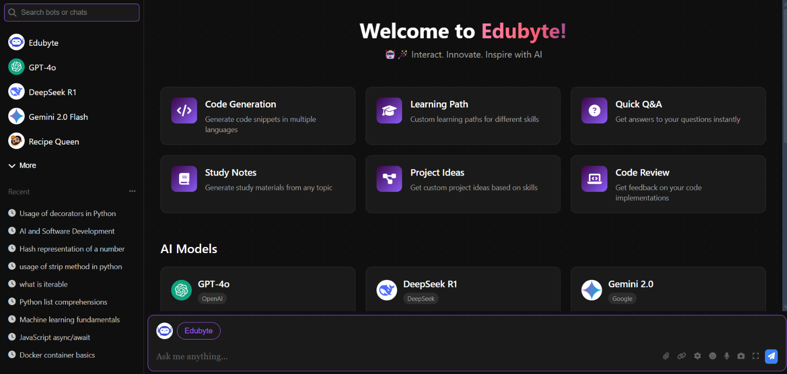

## 🤖🪄 Edubyte - "Interact. Innovate. Inspire with AI"


Edubyte is an AI powered platform where user can interact with different generative AI including advanced LLMs GPT-40, DeepSeek, Gemini 2.0 Flash, Mistral AI and many more. 

## 🌟 Features 
- 🧠 Interact with Advanced LLMs like GPT-40, DeepSeek, Gemini 2.0 Flash, Mistral AI, and more.

- 🔗 Supports GitHub PAT Integration for seamless model access.

- 🧩 Basic AI models included to boost productivity.

- 🚀 User-friendly UI with modern dark theme and an intuitive design.

- 🪶 Flexible and lightweight website developed by flask.

## 🛠️ Technologies Used
- **Frontend:** HTML, CSS, JavaScript
- **Backend:** Python (Flask)
- **Database:** FlaskSQL
- **Authentication:** GitHub PAT Integration 
- **Deployment:** TBD

## 🧠 Available AI Models 
- **GPT-40:** OpenAI one of the most advanced multimodal AI with superior text and code generation capabilities.💡
  
- **DeepSeek:** An open-weight AI model optimized for reasoning and coding tasks. 🐳
  
- **Gemini 2.0 Flash:** A lightweight, fast-response LLM developed by Google.⚡
  
- **Edubyte:** A friendly chatAssistant for instant answer to your daily queries. 🚀

- **Spoiler Alert:** More interactive AI models are coming soon! ☢️

## ⚙️ Installation

1. Clone the repository:
```bash
git clone https://github.com/BikramMondal5/Edubyte.git
```

2. Navigate to the project directory:
```bash
cd Edubyte
```

3. Install dependencies
```bash
pip install -r requirements.txt
```
   
4. Run `python app.py`

5. Open your web browser and go to `http://127.0.0.1:5000/` to interact with AI models.

## ☎️ Contact
For any queries or feedback, feel free to reach me at `codesnippets45@gmail.com`. 

## 🤝 Contributing
Contributions are welcome! Feel free to open an issue or submit a pull request to enhance Edubyte.

**Present Contributors (In alphabetical order)**: 1. `Ashmita Ray, Technical Documentation Designer`, 2. `Ashutosh Singh, Ideate`, 3. `Bikram Mondal, Ideate, Speaker & Development`4. `Modhura Banerjee, Technical Documentation Designer`, 4. `Upolobdhi Karmakar, Ideate & Speaker`.

## 📜 License
This project is licensed under the `MIT License`. See the [LICENSE](LICENSE) file for more details.
