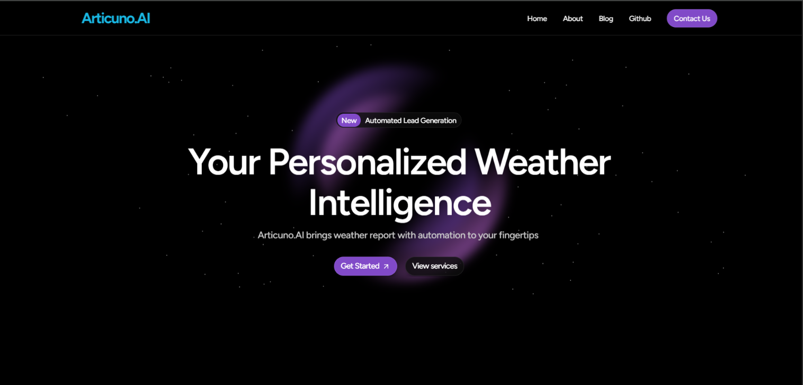

## 🤖🪄 Articuno.AI v1.0 - "Interact. Innovate. Inspire with AI"


Articuno.AI is an intelligent weather agent that provides real-time weather updates, daily forecasts, and emergency alerts — all powered by the OpenWeatherMap API. It integrates seamlessly with Gmail and Slack to deliver weather reports exactly when and where you need them. Beyond weather, users can also interact with different generative AI including advanced LLMs GPT-40, DeepSeek, Gemini 2.0 Flash, Mistral AI and many more.

## 🌟 Features 
- 🌦️ **Intelligent Weather Agent** - Get real-time weather updates, forecasts, and emergency alerts powered by OpenWeatherMap API.

- 📧 **Seamless Integrations** - Works with Gmail and Slack to deliver weather reports exactly when and where you need them.

- 📞 **Emergency Alerts** - With Twilio integration, Articuno.AI can call you with a recorded voice alert during severe weather, ensuring you're always prepared.

- 🧠 **Advanced AI Models** - Interact with various LLMs like GPT-40, DeepSeek, Gemini 2.0 Flash, Mistral AI, and more.

- 🔗 **GitHub PAT Integration** - Seamless model access through GitHub Personal Access Tokens.

- 🧩 **Basic AI models** - Included to boost productivity.

- 🚀 **User-friendly UI** - Modern dark theme with an intuitive design.

- 🪶 **Flexible Architecture** - Lightweight website developed with Flask.

## 🛠️ Technologies Used
- **Frontend:** HTML, CSS, JavaScript
- **Backend:** Python (Flask)
- **Database:** FlaskSQL
- **Authentication:** GitHub PAT Integration
- **APIs:** OpenWeatherMap, Twilio, Gmail, Slack
- **Deployment:** TBD

## 🧠 Available AI Models 
- **Articuno.AI:** Your friendly weather assistant that keeps you informed, safe, and one step ahead. 🌦️

- **GPT-40:** OpenAI one of the most advanced multimodal AI with superior text and code generation capabilities. 💡
  
- **DeepSeek:** An open-weight AI model optimized for reasoning and coding tasks. 🐳
  
- **Gemini 2.0 Flash:** A lightweight, fast-response LLM developed by Google. ⚡
  
- **Recipe Queen:** Your culinary assistant for recipes, cooking tips, and meal planning. 🍳

- **Spoiler Alert:** More interactive AI models are coming soon! ☢️

## ⚙️ Installation

1. Clone the repository:
```bash
git clone https://github.com/BikramMondal5/Articuno.AI.git
```

2. Navigate to the project directory:
```bash
cd Articuno.AI
```

3. Install dependencies
```bash
pip install -r requirements.txt
```
   
4. Configure API Keys
   - Create a `.env` file with the following keys:
   ```
   OPENWEATHER_API_KEY=your_openweather_api_key
   GEMINI_API_KEY=your_gemini_api_key
   TWILIO_ACCOUNT_SID=your_twilio_sid
   TWILIO_AUTH_TOKEN=your_twilio_token
   ```

5. Run `python app.py`

6. Open your web browser and go to `http://127.0.0.1:5000/` to interact with AI models.

## ☎️ Contact
For any queries or feedback, feel free to reach me at `codesnippets45@gmail.com`. 

## 🤝 Contributing
Contributions are welcome! Feel free to open an issue or submit a pull request to enhance Articuno.AI.

## 📜 License
This project is licensed under the `MIT License`.
